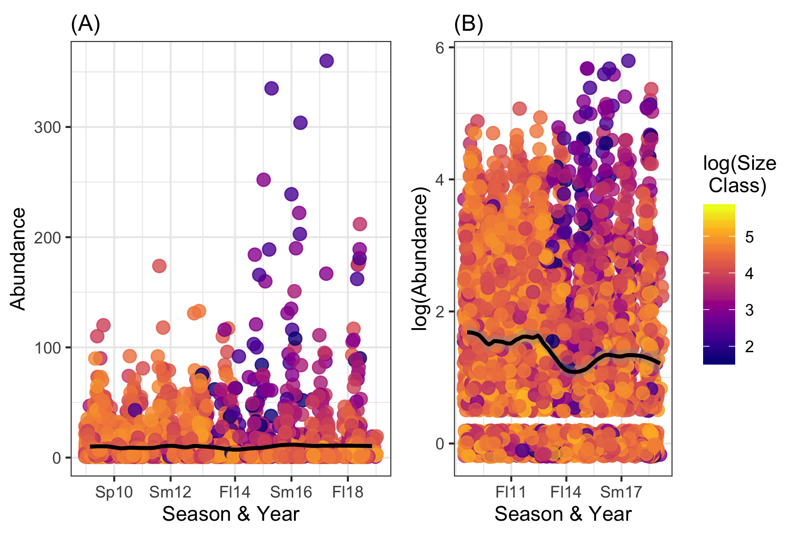
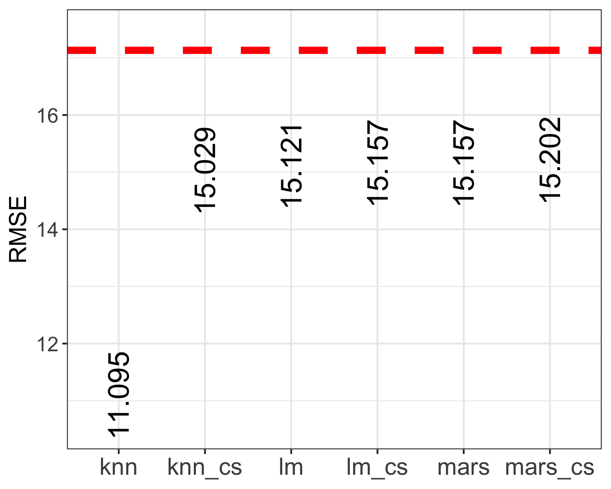
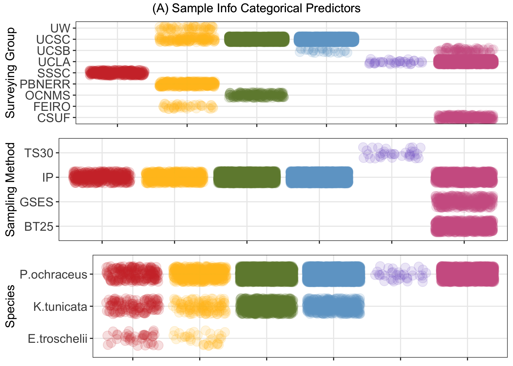
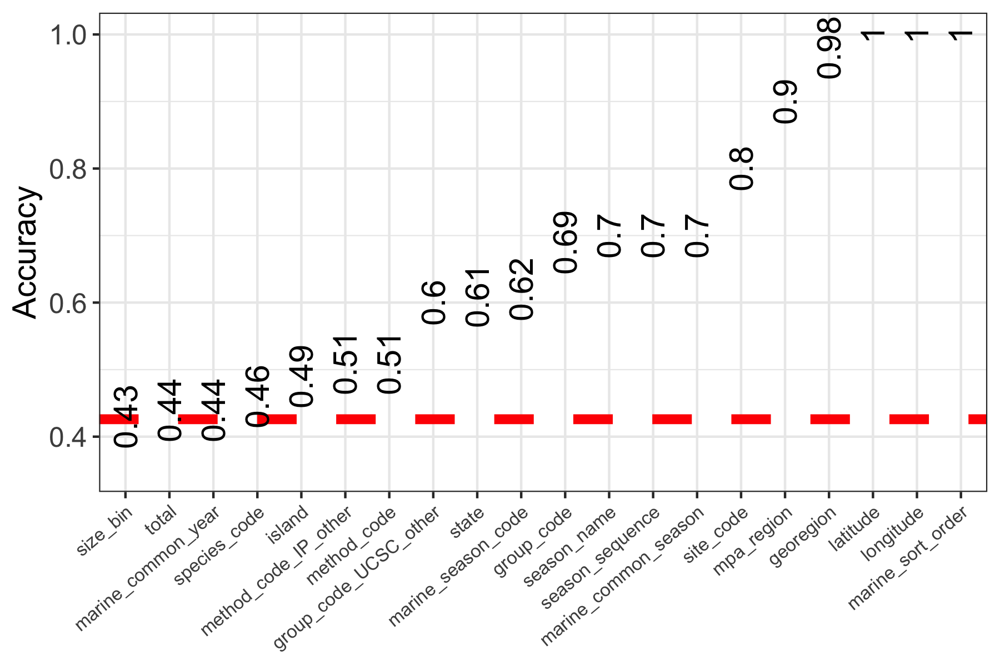

# Exploratory Analyses
## Mapping Survey Sites
```{r Fig1, fig.cap="Fig 1. Sampling sites included in this study that are located in Alaska, USA (color-coded red).", echo=FALSE}

```

```{r Fig2, fig.cap="Fig 2. Sampling sites included in this study that are located in Washington, USA (color-coded purple).", echo=FALSE}
knitr::include_graphics("../../results/Exploratory_Analysis_results/2.WA_sites_map.png")
```

```{r Fig3, fig.cap="Fig 3. Sampling sites included in this study that are located in Oregon, USA (color-coded orange).", echo=FALSE}
knitr::include_graphics("../../results/Exploratory_Analysis_results/3.OR_sites_map.png")
```

```{r Fig4, fig.cap="Fig 4. Sampling sites included in this study that are located in California, USA (color-coded teal).", echo=FALSE}

```

## How does species abundance change across time and space? 

```{r Fig5, fig.cap="Fig 5. Log-transformed counts of all species included in the surveyed (“spp. abundance”) across all sampling years in the data set (2000-2018), separated by state (AK=Alaska, WA=Washington, OR=Oregon, CA=California) and displayed as a scatterplot.", echo=FALSE}
knitr::include_graphics("../../results/Exploratory_Analysis_results/6.Abundance_State_Year_graphs.png")
```

```{r Fig6, fig.cap="Fig 6. Log-transformed counts of the ochre sea star (Pisaster ochraceus) across all sampling years in the data set (2000-2018) across all sampling locations,  displayed as a series of boxplots.", echo=FALSE}
knitr::include_graphics("../../results/Exploratory_Analysis_results/7.P.ochra_only_2000-2018.png")
```

```{r Fig7, fig.cap="Fig 7. Log-transformed counts of the black chiton (Katharina tunicata) across all sampling years in the data set (2009-2018) across all sampling locations,  displayed as a series of boxplots. This species was not recorded prior to 2009.", echo=FALSE}
knitr::include_graphics("../../results/Exploratory_Analysis_results/8.K.tuni_only_2000-2018.png")
```

```{r Fig8, fig.cap="Fig 8. Log-transformed counts of the mottled sea star (Evasterias troschelii) across all sampling years in the data set (2009-2018) across all sampling locations,  displayed as a series of boxplots. This species was not recorded prior to 2009.", echo=FALSE}

```

## Are there discernable changes in spp. abundance before & after the focal SSWD event? 

```{r Fig9, fig.cap="Fig 9. Maps displaying the sampling locations where the three species surveyed [ochre sea star (Pisaster ochraceus), black chiton (Katharina tunicata), mottled sea star (Evasterias troschelii)] were found between 2013 and 2016, during the focal sea star wasting disease (SSWD) event of interest. Note that locations are approximate; site points were jittered to allow more complete visualization.", echo=FALSE}

```

```{r Fig10, fig.cap="Fig 10. Log-transformed counts of the ochre sea star (Pisaster ochraceus) across all sampling locations during the years surrounding a significant sea star wasting disease (SSWD) event (2013-2016), displayed as a series of boxplots.", echo=FALSE}
knitr::include_graphics("../../results/Exploratory_Analysis_results/10.P.ochra_SSWDtf_plot.png")
```

```{r Fig11, fig.cap="Fig 11. Log-transformed counts of the black chiton (Katharina tunicata) across all sampling locations during the years surrounding a significant sea star wasting disease (SSWD) event (2013-2016), displayed as a series of boxplots.", echo=FALSE}
knitr::include_graphics("../../results/Exploratory_Analysis_results/11.K.tuni_SSWDtf_plot.png")
```

```{r Fig12, fig.cap="Fig 12. Log-transformed counts of the mottled sea star (Evasterias troschelii) across all sampling locations during the years surrounding a significant sea star wasting disease (SSWD) event (2013-2016), displayed as a series of boxplots.", echo=FALSE}

```

```{r Fig13, fig.cap="Fig 13. Log-transformed counts of (A) ochre sea star (Pisaster ochraceus) (B) black chiton (Katharina tunicata) and (C) mottled sea star (Evasterias troschelii) across sampling locations during the years surrounding a significant sea star wasting disease (SSWD) event (2013-2016), separated by state and displayed as a series of boxplots.", echo=FALSE}

```

```{r Fig14, fig.cap="Fig 14. Log-transformed counts of the ochre sea star (Pisaster ochraceus; top, in purple) and black chiton (Katharina tunicata; bottom, in orange) across sampling locations during the years surrounding a significant sea star wasting disease (SSWD) event (2013-2016), separated into sampling seasons (for example, Sp13 = Spring 2013) corresponding to and displayed as a series of boxplots.", echo=FALSE}
knitr::include_graphics("../../results/Exploratory_Analysis_results/14.Season_year_boxplot_po_kt.png")
```

## How did populations of the focal sp., P. ochraceus, respond & recover from the SSWD event?

```{r Fig15, fig.cap="Fig 15. Log-transformed counts of the ochre sea star (Pisaster ochraceus) during the years surrounding a significant sea star wasting disease (SSWD) event (2013-2016); each panel represents of the six sites that had high abundance counts prior to the SSWD event (50+ individuals counted during 2013). The data is displayed as a series of density plots shaded by quartiles (lightest to darkest, or left to right, corresponds to 1st through 4th quartiles); in other words, each block of color represents 25% of the area.", echo=FALSE}
knitr::include_graphics("../../results/Exploratory_Analysis_results/16.P.ochra_SSWDtf_over50_bysite_fig.png")
```

```{r Fig16, fig.cap="Fig 16. (A) Log-transformed counts and (B) size class of the ochre sea star (Pisaster ochraceus) during an 8-year period (2010-2018) surrounding a significant sea star wasting disease (SSWD) event across all sites. The data is displayed as a series of density plots shaded by quartiles.", echo=FALSE}
knitr::include_graphics("../../results/Exploratory_Analysis_results/17.P.ochra_size.vs.abundance_density_allsites.png")
```

```{r Fig17, fig.cap="Fig 17. (A) Log-transformed counts and (B) size class of the ochre sea star (Pisaster ochraceus) during an 8-year period (2010-2018) surrounding a significant sea star wasting disease (SSWD) event filtered to only include sites with high counts pre-SSWD (50+ individuals counted during 2013). The data is displayed as a series of density plots shaded by quartiles.", echo=FALSE}

```

```{r Fig18, fig.cap="Fig 18. (A) Raw counts/abundance and (B) log-transformed counts in Pisaster ochraceus during an 8-year period (2010-2018), separated into sampling seasons (Sp10 = Spring 2010, etc.) across all sites surveyed. Data is displayed as a scatterplot; points are colored by the log-transformed size class and the regression lines are plotted using a LOESS (locally weighted smoothing) model.", echo=FALSE}

```

## Full machine learning analyses

### Which variables predict species abundance?

```{r Fig19, fig.cap="Fig 19. Plotting numeric predictors against the outcome of interest, ochre sea star (P. ochraceus) abundance (log-transformed “total”). Note: The purpose of this figure is to provide a quick visualization and is not intended to be detailed enough to resolve specific trends.", echo=FALSE}
knitr::include_graphics("../../results/Continuous_Outcome_Modeling_results/1.count_vs_numerical.png")
```

```{r Fig20, fig.cap="Fig 20. Plotting categorical predictors against the outcome of interest, ochre sea star (P. ochraceus) abundance (log-transformed “total”). Note: The purpose of this figure is to provide a quick visualization and is not intended to be detailed enough to resolve specific trends.", echo=FALSE}

```

```{r Fig21, fig.cap="Fig 21. Results of (A) single predictor models and (B) multiple predictor models, evaluated on the training data using the performance metric RMSE (root mean squared error). The red dashed line represents the RMSE of the null model (null model RMSE = 17.13).", echo=FALSE}
knitr::include_graphics("../../results/Continuous_Outcome_Modeling_results/3.Predictor_RMSE.png")
```

```{r Fig22, fig.cap="Fig 22. Results of multiple predictor models before and after centering and scaling (ex. knn and knn_cs denote before and after, respectively), evaluated on the training data using the performance metric RMSE (root mean squared error). The red dashed line represents the RMSE of the null model (null model RMSE = 17.13).", echo=FALSE}

```

```{r Fig23, fig.cap="Fig 23. Predicted versus outcome residuals for the best-fitting model (knn) on the training data.", echo=FALSE}
knitr::include_graphics("../../results/Continuous_Outcome_Modeling_results/5.Residuals.png")
```

```{r Fig24, fig.cap="Fig 24. Results of the best fitting model (knn, or “fit_3”), evaluated on the training and test data using the performance metric RMSE (root mean squared error). The RMSE of the null model on each of the two data sets is also displayed (“Null_train” and “Null_test”) for context and comparison.", echo=FALSE}
knitr::include_graphics("../../results/Continuous_Outcome_Modeling_results/6.final_results_RMSE.png")
```


###  Can we predict bioregion using variable selection and tree-fitting models?

```{r Fig25, fig.cap="Fig 25. Histogram displaying the distribution of sampling across the six bioregions of the data set. Abbreviations: AK to British Columbia = Alaska, USA to British Columbia, Canada; Salish Sea, WA = Salish Sea, WA, USA; Olympic Coast WA to SanFran = Olympic Coast, WA, USA to San Francisco, CA, USA; SanFran to Gov't Point = San Francisco to Government Point, CA, USA; Channel Islands South = Channel Islands South, CA, USA; Gov't Point to Mexico = Government Point, CA, USA to Mexico.", echo=FALSE}
knitr::include_graphics("../../results/Categorical_Outcome_Modeling_results/1.bioregion_histogram.png")
```

```{r Fig26, fig.cap="Fig 26. Plotting (A) spatial (B) temporal and (C) species-related numeric predictors as a function of the category of interest, bioregion (red = Alaska, USA to British Columbia, Canada; yellow = Salish Sea, WA, USA; green = Olympic Coast, WA, USA to San Francisco, CA, USA; blue = San Francisco to Government Point, CA, USA; purple = Channel Islands South, CA, USA; pink = Government Point, CA, USA to Mexico). The data is displayed as boxplots with all points overlaid. Note: The purpose of this figure is to provide a quick visualization and is not intended to be detailed enough to resolve specific trends.", echo=FALSE}
knitr::include_graphics("../../results/Categorical_Outcome_Modeling_results/2.spatial_num_pred.png")
knitr::include_graphics("../../results/Categorical_Outcome_Modeling_results/3.temporal_num_pred.png")
knitr::include_graphics("../../results/Categorical_Outcome_Modeling_results/4.spp.rel_num_pred.png")
```

```{r Fig27, fig.cap="Fig 27. Plotting (A) logistics/sampling info (B) spatial and (C) ecological categorical predictors as a function of the category of interest, bioregion (red = Alaska, USA to British Columbia, Canada; yellow = Salish Sea, WA, USA; green = Olympic Coast, WA, USA to San Francisco, CA, USA; blue = San Francisco to Government Point, CA, USA; purple = Channel Islands South, CA, USA; pink = Government Point, CA, USA to Mexico). Note: The purpose of this figure is to provide a quick visualization and is not intended to be detailed enough to resolve specific trends.", echo=FALSE}

knitr::include_graphics("../../results/Categorical_Outcome_Modeling_results/6.spatial_cat_pred.png")
knitr::include_graphics("../../results/Categorical_Outcome_Modeling_results/7.eco_cat_pred.png")
```

```{r Fig28, fig.cap="Fig 28. Results of single predictor models attempting to predict bioregion, evaluated on the training data using the performance metric accuracy (ACC). ACC is the overall agreement rate averaged over cross-validation iterations. The red dashed line represents the ACC of the null model (null model ACC = 0.426) and predictors falling to the right blue dashed line were removed after this step for having too strong of a correlation with bioregion (>70% accuracy and with logical reasoning as to why such was the case).", echo=FALSE}

```

```{r Fig29, fig.cap="Fig 29. Results of four full logistical models [GBM (boosted tree ensemble), PDA (discriminant analysis), RF1 (random forest), and RF2 (random forest with pre-processed predictors)] attempting to predict bioregion using the subset training data and evaluated on the training data using the performance metrics accuracy and kappa. “Kappa” is Cohen’s (unweighted) Kappa statistic averaged across the resampling results. ", echo=FALSE}
knitr::include_graphics("../../results/Categorical_Outcome_Modeling_results/11.Accuracy_Kappa_Models_notree.png")
```

```{r Fig30, fig.cap="Fig 30. Confusion matrix describing the performance of the best-fitting logistical classification model (GBM, or boosted tree ensemble) on the subset test data.", echo=FALSE}

```

```{r Fig31, fig.cap="Fig 31. Confusion matrix describing the performance of the best-fitting logistical classification model (GBM, or boosted tree ensemble) on the subset test data.", echo=FALSE}

```

```{r Fig32, fig.cap="Fig 32. Results of the best-fitting logistical classification model (GBM, or boosted tree ensemble), evaluated on the training and test data using the performance metric accuracy (ACC). The ACC of the null model on each of the two data sets is also displayed (“Null_train” and “Null_test”) for context and comparison.", echo=FALSE}

```
