# Summary/Abstract
_Write a summary of your project._

# Introduction

## General Background Information
### Broad Scope: Characterizing Sea Star Wasting Disease
Outbreaks of infectious disease are an important, yet poorly understood, driving force in population biology and, while prevalent in both terrestrial and marine systems, the manner by which outbreaks influence biotic relationships, age demographics, community structure and function, and trophic interactions in the aquatic realm consistently lags behind that of terrestrial disease ecology. The growing body of evidence in this field, however, supports the observation that marine disease epidemics are increasing in frequency and severity (Orth et al., 2006; Waycott et al., 2009). Elucidating the relationship between aquatic species and their pathogenic diseases is pertinent in the field of marine ecology because infection outbreaks have the potential to drastically alter ecosystem functionality (Blakesley et al., 2002; Burge et al., 2013). Many of the organisms which have faced chronic and/or severe outbreaks of disease (such as sea urchins, scleractinian corals and seagrasses) are also considered keystone species and/or ecosystem engineers, meaning that they contribute highly valuable services or functions to their surrounding community and ecosystem. Thus, it comes as no surprise that disease-driven mass mortalities of these species often generate waves of ecological permutation, ranging from temporary local disruptions to permanent phase shifts (Burge et al., 2013), such as the transformation from a coral to macroalgal dominated Caribbean reef structure that accompanied the massive _Diadema antillarum_ (black sea urchin) die-off of the early 1980s (Lessios et al., 1984; Lessios, 1988). This event, likely caused by a biological pathogen (Schultz et al., 2016), reduced Diadema populations to less than 1% of their original size (Lessios, 1988). Mass mortality events impacting critical foundation species, ecosystem engineers, or keystone species such as the black sea urchin have been coined ‘marine disease emergencies’ due to the detrimental cascade of events that often succeeds them (Miner et al., 2018). 

Sea Star Wasting Disease (SSWD) is another epizootic crisis facing modern day coastal ecosystems. Outbreaks of asteroid wasting have been documented periodically since the late 1970s and SSWD describes a suite of symptoms observed across a broad range of sea star species, most of which play integral parts in shaping their community structure. Generally speaking, the wasting disease events which punctuated the past four decades were relatively brief, in localized areas, and largely failed to capture the attention of the scientific community. Beginning in summer 2013, however, mass mortalities of sea stars due to wasting disease have caused unprecedented damage, owing to the geographical and temporal extent of impact. This ongoing epizootic, which has killed millions of asteroids across over 20 taxa, is widely referred to as the largest disease event sweeping through a wildlife marine species in documented history (Hewson et al. 2014, Gudenkauf & Hewson, 2015, Eisenlord et al. 2016). 


## Description of data and data source
### The Source
The vast majority of disease documentation and surveys cover the west coast of the United States. While it is almost certainly true that SSWD is most prevalent in this region, there is a strong bias towards the discovery of diseased organisms owing to the emphasis of long-term survey networks in the area, such as the extensive [Multi-Agency Rocky Intertidal Network](https://marine.ucsc.edu/index.html) (MARINe for short). The vast majority of what we know about SSWD dynamics comes from studies along the Pacific Coast of North America using data produced through the combined effort of dedicated scientists, government agencies, and local citizens. The purpose of this investigation is to make use of this data monitoring system to investigate spatial and temoporal changes in sea star abundance along the west coast of the United States. 

### The Data
Below I explore the raw data I downloaded from a link I recieved after submitting a request for the data on the MARINe webpage.

Notably, it contains the following information (some parameters removed from this overview): 

* `groupcode`: The unique code for each monitoring group
* `marine_site_name`: The name of the site where the survey was conducted.
* `latitude` and `longitude`: (self explanatory)
* `marine_season_code`: A four-character code to identify the Sampling season. The first two characters indicate the season and the last 2 characters indicate the year.
* `method_code`: The method used for sampling the plot. 
* `size_bin`: The size of the species being counted, binned to the nearest 5 or 10 millimeter.
* `target_assemblage`: The specific organism that this transect was created to monitor.
* `total`: Total number of individuals counted in a given size_bin
* `mpa_designation`: Describes whether the referenced site is located within a Marine Protected Area (MPA) or is a reference site. If this field is blank, the referenced site is not located within an MPA, or is not a reference site for an existing MPA site.
* `georegion`/ `bioregion`: geographic/biogeographic region in which site is located
* `state_province`: The State or Province and Country where the referenced site is located.
* `island`: The name of the island where the referenced site is located. Sites not on islands are designated as mainland.

## Questions/Hypotheses to be addressed
_State the research questions you plan to answer with this analysis_

How does species abundance change across time and space? 

Are there discernable changes in spp. abundance before & after the focal SSWD event?

How did populations of the focal sp., P. ochraceus, respond & recover from the SSWD event?

Which variables predict species abundance?

Can we predict bioregion using the data and tree-fitting model?

**1. Are sea star populations changing over time?** 
I anticipate that there will be a decline in sea star populations over time, but that the change will not occur uniformly across geographical regions and species. Species that are reported to have been affected by SSWD will experience the biggest declines. 

**2. Are there definable geographical regions throught space based on predictor variables?**
I expect to be able to define rough species ranges. 

**3. Is there evidence of sampling bias?**
Is there a relationship between important survey parameters (mainly, abundance data) and sampling method (ex. group conducting the survey, plot sampling method, the target assemblage). At the very least, I expect there will be bias based on the targeted organism of the survey; if a given survey aims to characterize the presence of one species of sea stars, it is likely that they will seek out that species and record higher counts. 

# Methods and Results

_In most research papers, results and methods are separate. You can combine them here if you find it easier. You are also welcome to structure things such that those are separate sections._

## Data import and cleaning
_Write code that reads in the file and cleans it so it's ready for analysis. Since this will be fairly long code for most datasets, it might be a good idea to have it in one or several R scripts. If that is the case, explain here briefly what each file does. The files themselves should be commented well so everyone can follow along._

The original data was downloaded from a link I recieved after submitting a request for the data on the Multi-Agency Rocky Intertidal Network, or MARINe, [webpage](https://marine.ucsc.edu/index.html). The raw data is found here: `./data/raw_data/seastarkat_size_count_totals_download.csv`. 

This data was cleaned extensively prior to use in this analysis, and the code which performs this cleaning is found here: `./code/processing_code/processing_script`. Briefly, this involved examining each variable by plotting factors as bar plots and integers/numerics as histograms. This allowed me to observe the structure of each variable and make necessary changes to clean the data. Below, I describe some of these changes:

## Exploratory analyses
_Use a combination of text/tables/figures to explore and describe your data. You should produce plots or tables or other summary quantities for most of your variables. You definitely need to do it for the important variables, i.e. if you have main exposure or outcome variables, those need to be explored. Depending on the total number of variables in your dataset, explore all or some of the others._

The code which performed my exploratory analyses can be found here: `./code/analysis_code/Exploratory_Analysis.Rmd`

### Mapping Survey Sites
First, I created geographical maps to visualize the sample sites. Sites were sampled in four states:

```{r Fig1, fig.cap="Fig 1. Sampling sites included in this study that are located in Alaska, USA (color-coded red).", echo=FALSE}
knitr::include_graphics("../../results/Exploratory_Analysis_results/1.AK_sites_map.png")
```

```{r Fig2, fig.cap="Fig 2. Sampling sites included in this study that are located in Washington, USA (color-coded purple).", echo=FALSE}
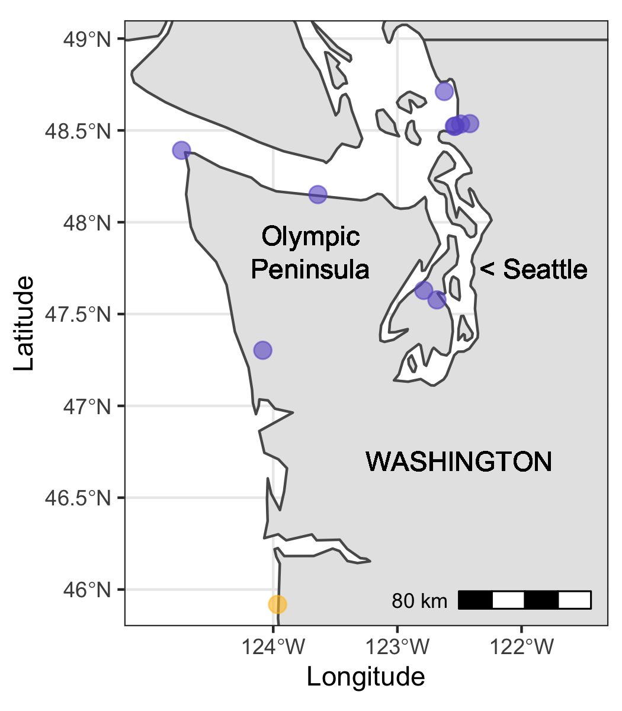
```

```{r Fig3, fig.cap="Fig 3. Sampling sites included in this study that are located in Oregon, USA (color-coded orange).", echo=FALSE}
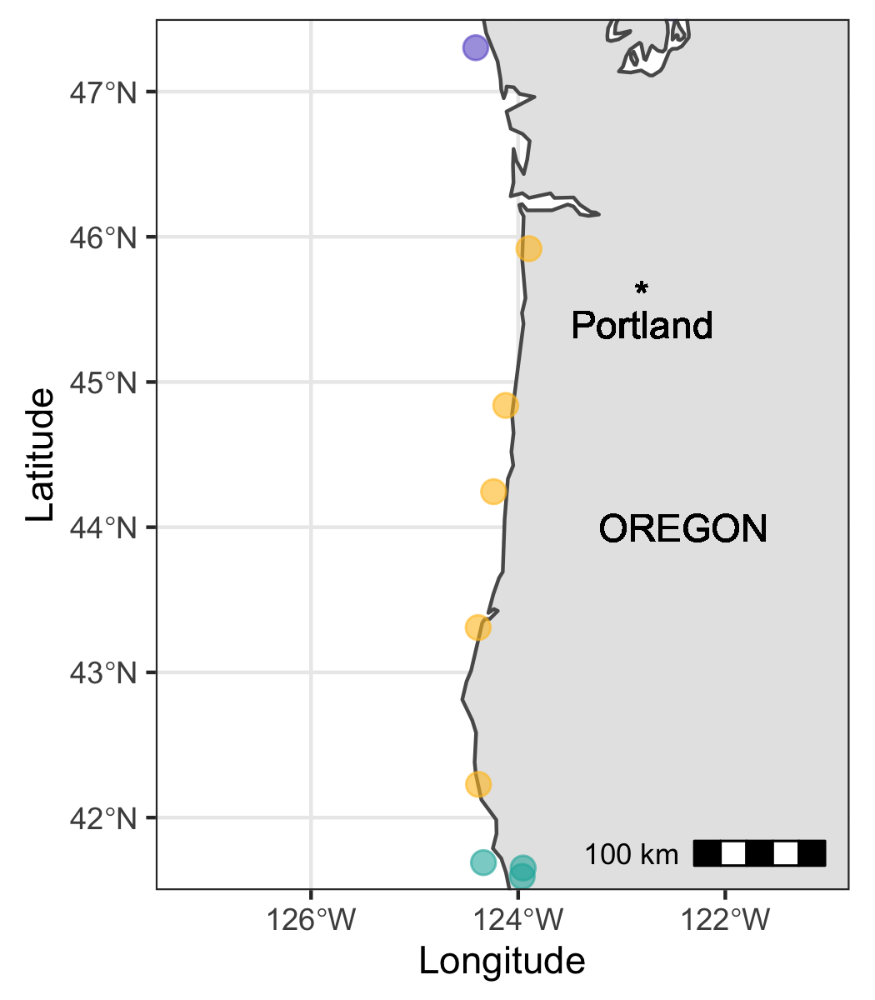
```

```{r Fig4, fig.cap="Fig 4. Sampling sites included in this study that are located in California, USA (color-coded teal).", echo=FALSE}
knitr::include_graphics("../../results/Exploratory_Analysis_results/4.CA_sites_map.png")
```

### How does species abundance change across time and space? 
```{r Fig5, fig.cap="Fig 5. Log-transformed counts of all species included in the surveyed (“spp. abundance”) across all sampling years in the data set (2000-2018), separated by state (AK=Alaska, WA=Washington, OR=Oregon, CA=California) and displayed as a scatterplot.", echo=FALSE}
knitr::include_graphics("../../results/Exploratory_Analysis_results/6.Abundance_State_Year_graphs.png")
```

```{r Fig6, fig.cap="Fig 6. Log-transformed counts of the ochre sea star (Pisaster ochraceus) across all sampling years in the data set (2000-2018) across all sampling locations,  displayed as a series of boxplots.", echo=FALSE}
knitr::include_graphics("../../results/Exploratory_Analysis_results/7.P.ochra_only_2000-2018.png")
```

```{r Fig7, fig.cap="Fig 7. Log-transformed counts of the black chiton (Katharina tunicata) across all sampling years in the data set (2009-2018) across all sampling locations,  displayed as a series of boxplots. This species was not recorded prior to 2009.", echo=FALSE}
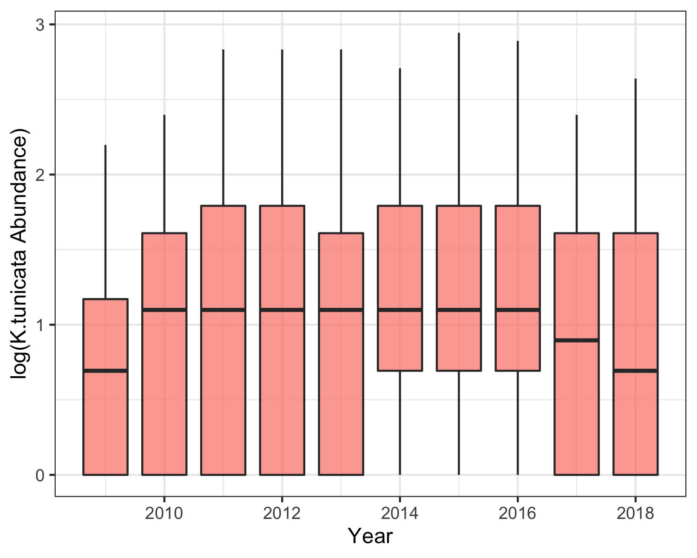
```

```{r Fig8, fig.cap="Fig 8. Log-transformed counts of the mottled sea star (Evasterias troschelii) across all sampling years in the data set (2009-2018) across all sampling locations,  displayed as a series of boxplots. This species was not recorded prior to 2009.", echo=FALSE}
knitr::include_graphics("../../results/Exploratory_Analysis_results/9.E.tros_only_2000-2018.png")
```

### Are there discernable changes in spp. abundance before & after the focal SSWD event? 

```{r Fig9, fig.cap="Fig 9. Maps displaying the sampling locations where the three species surveyed [ochre sea star (Pisaster ochraceus), black chiton (Katharina tunicata), mottled sea star (Evasterias troschelii)] were found between 2013 and 2016, during the focal sea star wasting disease (SSWD) event of interest. Note that locations are approximate; site points were jittered to allow more complete visualization.", echo=FALSE}
knitr::include_graphics("../../results/Exploratory_Analysis_results/14.SpeciesRangesSSWD.png")
```

```{r Fig10, fig.cap="Fig 10. Log-transformed counts of the ochre sea star (Pisaster ochraceus) across all sampling locations during the years surrounding a significant sea star wasting disease (SSWD) event (2013-2016), displayed as a series of boxplots.", echo=FALSE}
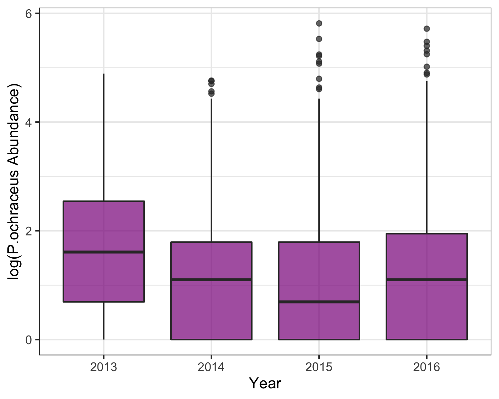
```

```{r Fig11, fig.cap="Fig 11. Log-transformed counts of the black chiton (Katharina tunicata) across all sampling locations during the years surrounding a significant sea star wasting disease (SSWD) event (2013-2016), displayed as a series of boxplots.", echo=FALSE}
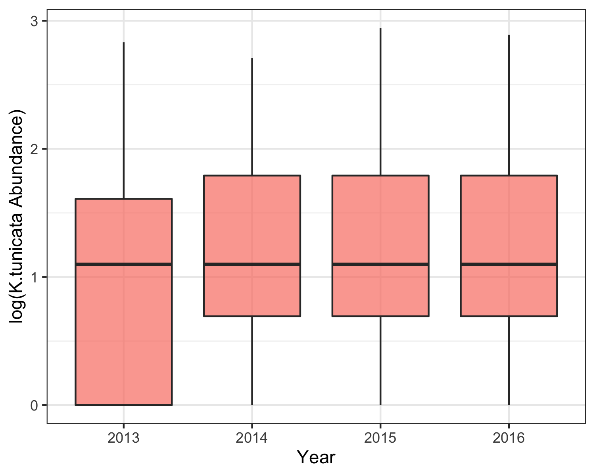
```

```{r Fig12, fig.cap="Fig 12. Log-transformed counts of the mottled sea star (Evasterias troschelii) across all sampling locations during the years surrounding a significant sea star wasting disease (SSWD) event (2013-2016), displayed as a series of boxplots.", echo=FALSE}
knitr::include_graphics("../../results/Exploratory_Analysis_results/12.E.tros_SSWDtf_plot.png")
```

```{r Fig13, fig.cap="Fig 13. Log-transformed counts of (A) ochre sea star (Pisaster ochraceus) (B) black chiton (Katharina tunicata) and (C) mottled sea star (Evasterias troschelii) across sampling locations during the years surrounding a significant sea star wasting disease (SSWD) event (2013-2016), separated by state and displayed as a series of boxplots.", echo=FALSE}
knitr::include_graphics("../../results/Exploratory_Analysis_results/13.Spp_SSWDtf_state_plot.png")
```

```{r Fig14, fig.cap="Fig 14. Log-transformed counts of the ochre sea star (Pisaster ochraceus; top, in purple) and black chiton (Katharina tunicata; bottom, in orange) across sampling locations during the years surrounding a significant sea star wasting disease (SSWD) event (2013-2016), separated into sampling seasons (for example, Sp13 = Spring 2013) corresponding to and displayed as a series of boxplots.", echo=FALSE}
knitr::include_graphics("../../results/Exploratory_Analysis_results/14.Season_year_boxplot_po_kt.png")
```

### How did populations of the focal sp., P. ochraceus, respond & recover from the SSWD event?
```{r Fig15, fig.cap="Fig 15. Log-transformed counts of the ochre sea star (Pisaster ochraceus) during the years surrounding a significant sea star wasting disease (SSWD) event (2013-2016); each panel represents of the six sites that had high abundance counts prior to the SSWD event (50+ individuals counted during 2013). The data is displayed as a series of density plots shaded by quartiles (lightest to darkest, or left to right, corresponds to 1st through 4th quartiles); in other words, each block of color represents 25% of the area.", echo=FALSE}
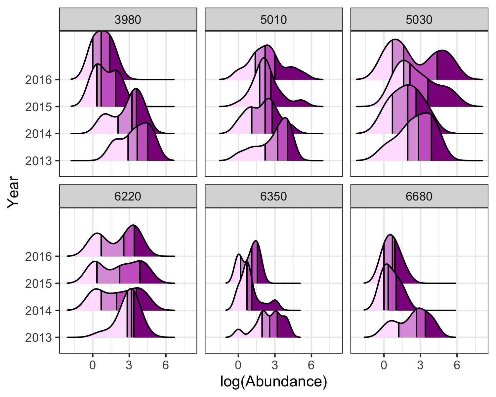
```

```{r Fig16, fig.cap="Fig 16. (A) Log-transformed counts and (B) size class of the ochre sea star (Pisaster ochraceus) during an 8-year period (2010-2018) surrounding a significant sea star wasting disease (SSWD) event across all sites. The data is displayed as a series of density plots shaded by quartiles.", echo=FALSE}
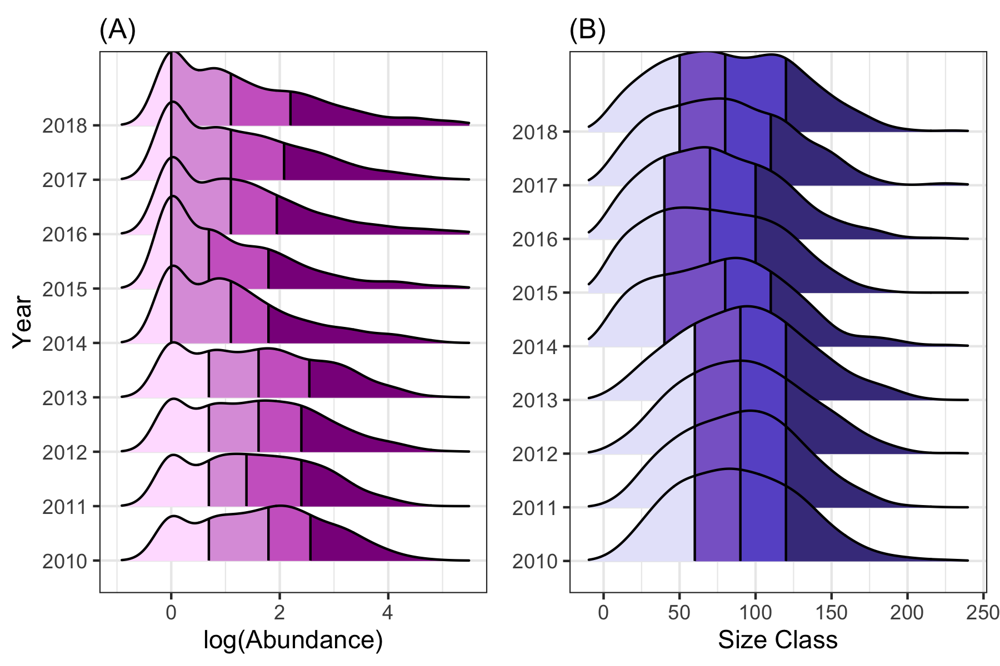
```

```{r Fig17, fig.cap="Fig 17. (A) Log-transformed counts and (B) size class of the ochre sea star (Pisaster ochraceus) during an 8-year period (2010-2018) surrounding a significant sea star wasting disease (SSWD) event filtered to only include sites with high counts pre-SSWD (50+ individuals counted during 2013). The data is displayed as a series of density plots shaded by quartiles.", echo=FALSE}
knitr::include_graphics("../../results/Exploratory_Analysis_results/18.P.ochra_size_abundance_density_over50.png")
```

```{r Fig18, fig.cap="Fig 18. (A) Raw counts/abundance and (B) log-transformed counts in Pisaster ochraceus during an 8-year period (2010-2018), separated into sampling seasons (Sp10 = Spring 2010, etc.) across all sites surveyed. Data is displayed as a scatterplot; points are colored by the log-transformed size class and the regression lines are plotted using a LOESS (locally weighted smoothing) model.", echo=FALSE}
knitr::include_graphics("../../results/Exploratory_Analysis_results/19.P.ochra_size_abundance_scatter.png")
```

## Full analysis 
_Use one or several suitable statistical/machine learning methods to analyze your data and to produce meaningful figures, tables, etc. This might again be code that is best placed in one or several separate R scripts that need to be well documented. You can then load the results produced by this code_

### Which variables predict species abundance?
The first used abundance counts (or the variable `total`) as the outcome predictor on a reduced dataset that only retained the species of interest, _Pisaster ochraceus_. This code is found here: `./code/analysis_code/Continuous_Outcome_Modeling.Rmd`.


```{r Fig19, fig.cap="Fig 19. Plotting numeric predictors against the outcome of interest, ochre sea star (P. ochraceus) abundance (log-transformed “total”). Note: The purpose of this figure is to provide a quick visualization and is not intended to be detailed enough to resolve specific trends.", echo=FALSE}
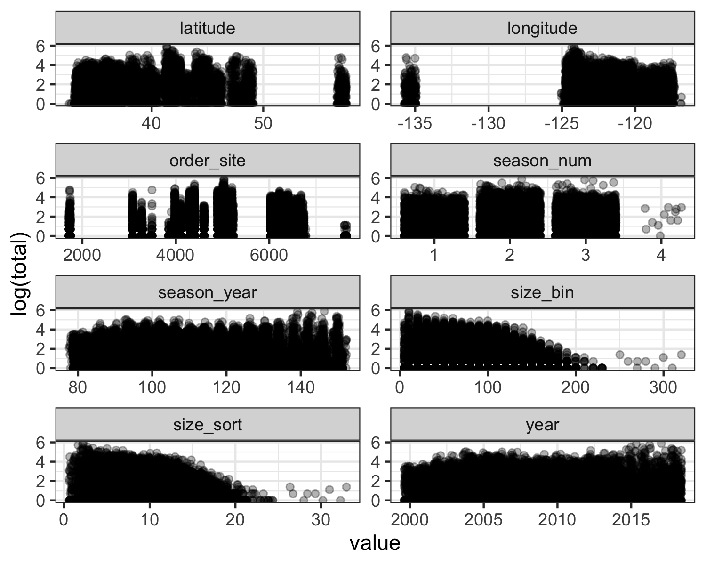
```

```{r Fig20, fig.cap="Fig 20. Plotting categorical predictors against the outcome of interest, ochre sea star (P. ochraceus) abundance (log-transformed “total”). Note: The purpose of this figure is to provide a quick visualization and is not intended to be detailed enough to resolve specific trends.", echo=FALSE}
knitr::include_graphics("../../results/Continuous_Outcome_Modeling_results/2.count_vs_categorical.png")
```

```{r Fig21, fig.cap="Fig 21. Results of (A) single predictor models and (B) multiple predictor models, evaluated on the training data using the performance metric RMSE (root mean squared error). The red dashed line represents the RMSE of the null model (null model RMSE = 17.13).", echo=FALSE}
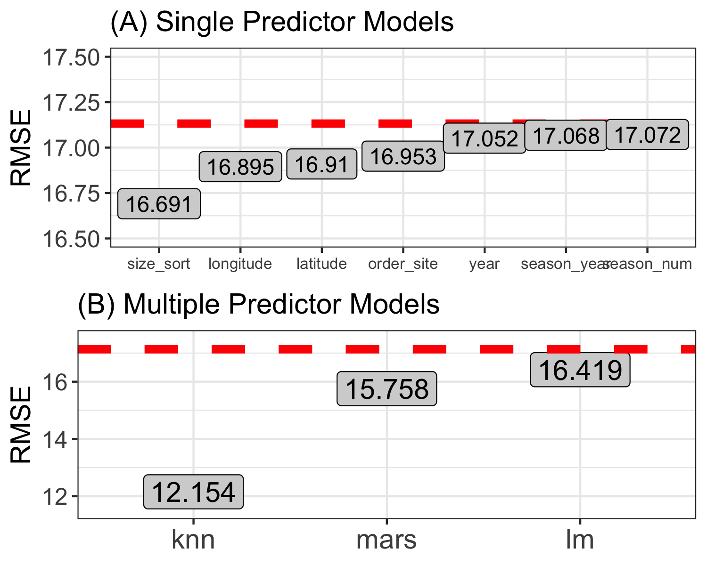
```

```{r Fig22, fig.cap="Fig 22. Results of multiple predictor models before and after centering and scaling (ex. knn and knn_cs denote before and after, respectively), evaluated on the training data using the performance metric RMSE (root mean squared error). The red dashed line represents the RMSE of the null model (null model RMSE = 17.13).", echo=FALSE}
knitr::include_graphics("../../results/Continuous_Outcome_Modeling_results/4.Multi_Predictor_RMSE_cs.png")
```

```{r Fig23, fig.cap="Fig 23. Predicted versus outcome residuals for the best-fitting model (knn) on the training data.", echo=FALSE}
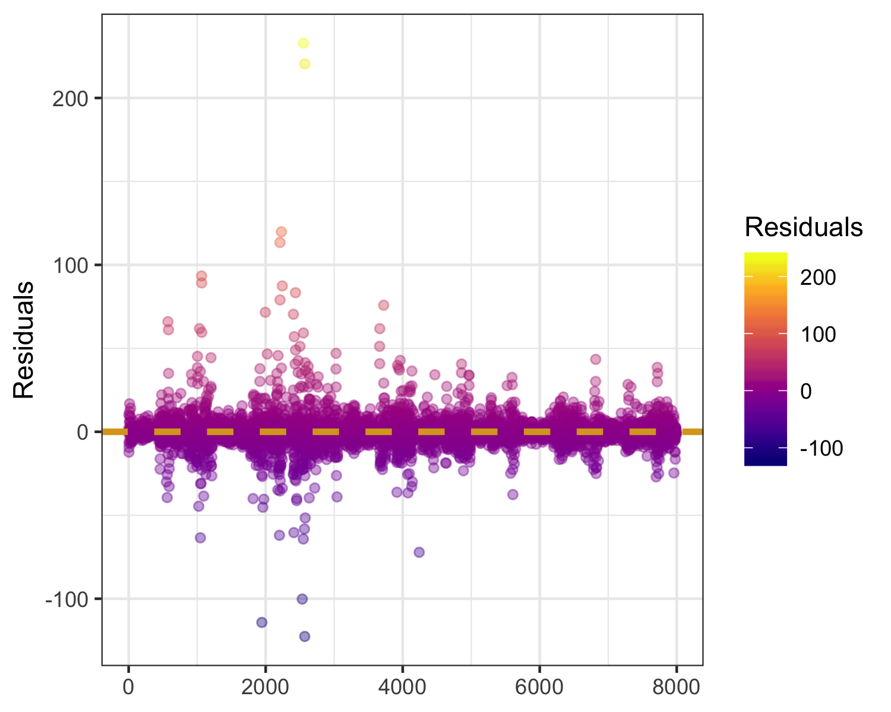
```

```{r Fig24, fig.cap="Fig 24. Results of the best fitting model (knn, or “fit_3”), evaluated on the training and test data using the performance metric RMSE (root mean squared error). The RMSE of the null model on each of the two data sets is also displayed (“Null_train” and “Null_test”) for context and comparison.", echo=FALSE}
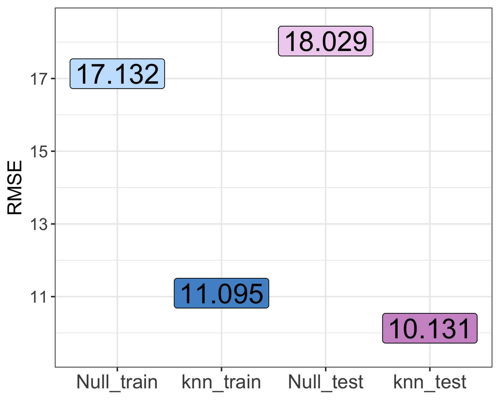
```


###  Can we predict bioregion using variable selection and tree-fitting models?
_For this analysis, our main outcome of interest is if an outbreak was caused by the G2.4 strain of norovirus or not, and how other factors might be correlated with that strain_

_cross validation. We could do data splitting again as we did in the previous exercise, to have a final test set. But since you saw how it works in the previous exercise, we skip it here. We use the full data to fit to our models. We’ll still use cross-validation to get a more honest estimate of model performance. For a real data analysis, the choice to keep some for a final test or not is based on your goals. If your focus is predictive performance, you should consider this split. If your focus is inference or exploratory analysis, you might want to skip this._

The second focused on the categorical variable `bioregion` and used a machine learning tree fitting method. This code is found here: `./code/analysis_code/Continuous_Outcome_Modeling.Rmd`.


```{r Fig25, fig.cap="Fig 25. Histogram displaying the distribution of sampling across the six bioregions of the data set. Abbreviations: AK to British Columbia = Alaska, USA to British Columbia, Canada; Salish Sea, WA = Salish Sea, WA, USA; Olympic Coast WA to SanFran = Olympic Coast, WA, USA to San Francisco, CA, USA; SanFran to Gov't Point = San Francisco to Government Point, CA, USA; Channel Islands South = Channel Islands South, CA, USA; Gov't Point to Mexico = Government Point, CA, USA to Mexico.", echo=FALSE}
knitr::include_graphics("../../results/Categorical_Outcome_Modeling_results/1.bioregion_histogram.png")
```

```{r Fig26, fig.cap="Fig 26. Plotting (A) spatial (B) temporal and (C) species-related numeric predictors as a function of the category of interest, bioregion (red = Alaska, USA to British Columbia, Canada; yellow = Salish Sea, WA, USA; green = Olympic Coast, WA, USA to San Francisco, CA, USA; blue = San Francisco to Government Point, CA, USA; purple = Channel Islands South, CA, USA; pink = Government Point, CA, USA to Mexico). The data is displayed as boxplots with all points overlaid. Note: The purpose of this figure is to provide a quick visualization and is not intended to be detailed enough to resolve specific trends.", echo=FALSE}
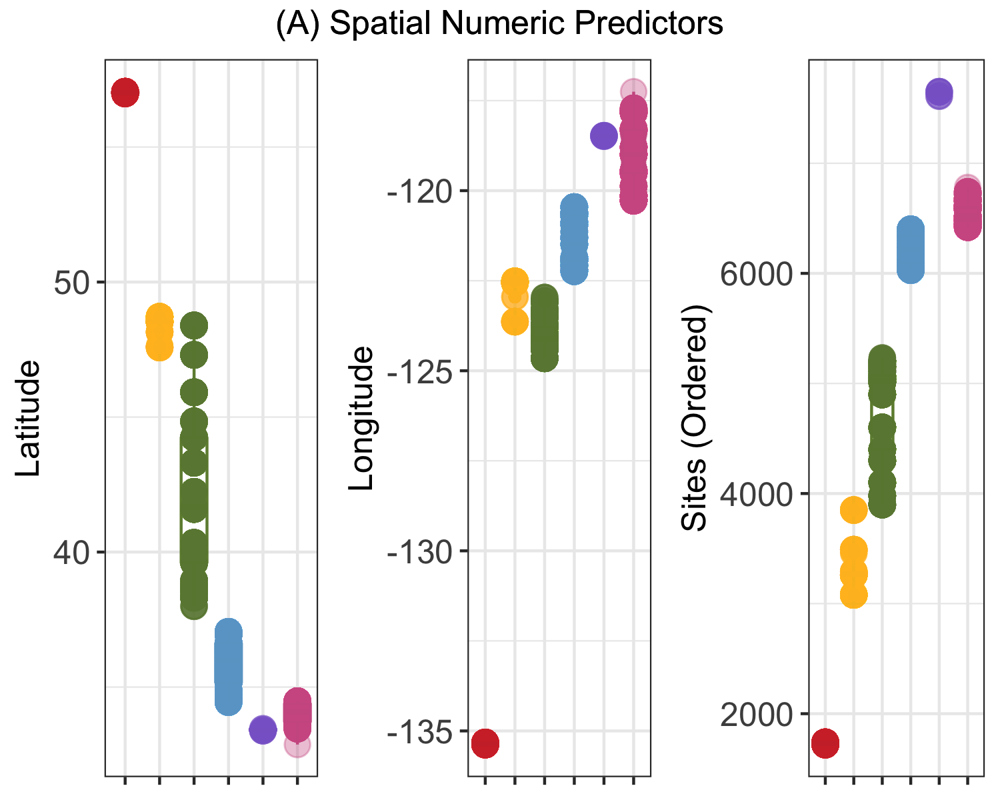
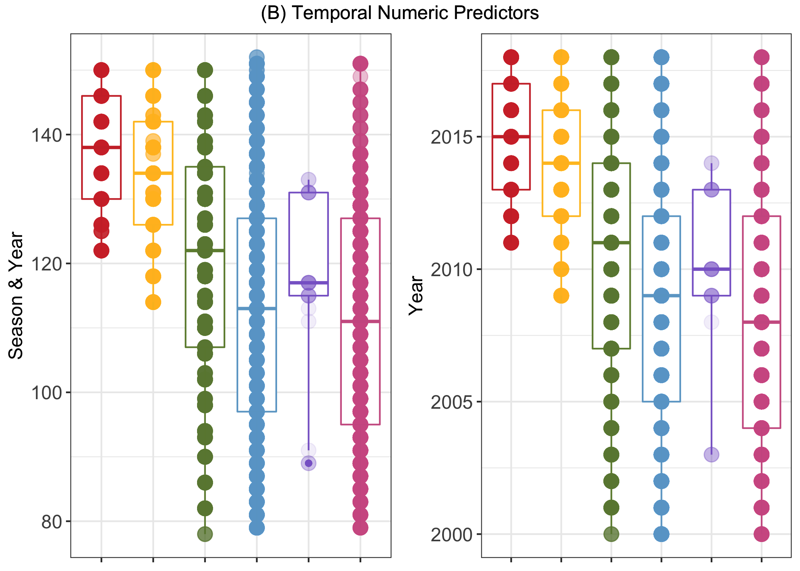
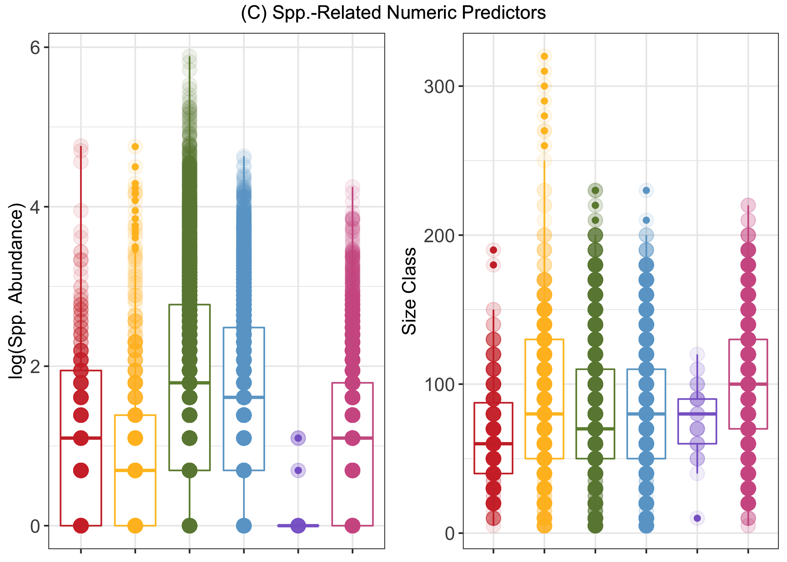
```

```{r Fig27, fig.cap="Fig 27. Plotting (A) logistics/sampling info (B) spatial and (C) ecological categorical predictors as a function of the category of interest, bioregion (red = Alaska, USA to British Columbia, Canada; yellow = Salish Sea, WA, USA; green = Olympic Coast, WA, USA to San Francisco, CA, USA; blue = San Francisco to Government Point, CA, USA; purple = Channel Islands South, CA, USA; pink = Government Point, CA, USA to Mexico). Note: The purpose of this figure is to provide a quick visualization and is not intended to be detailed enough to resolve specific trends.", echo=FALSE}
knitr::include_graphics("../../results/Categorical_Outcome_Modeling_results/5.sampleinfo_cat_pred.png")
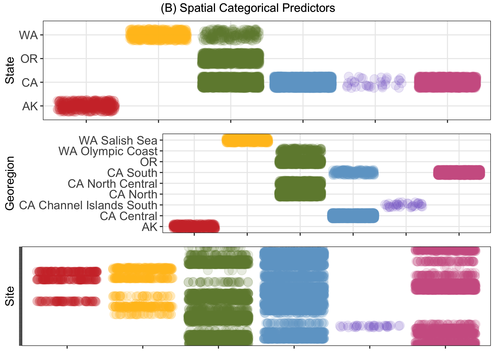
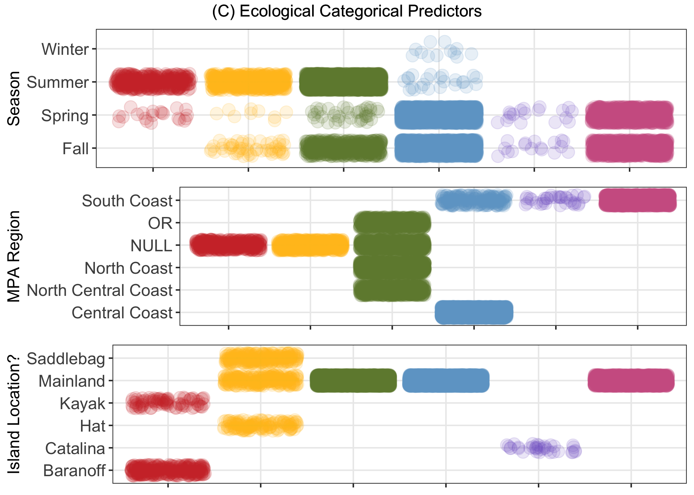
```

```{r Fig28, fig.cap="Fig 28. Results of single predictor models attempting to predict bioregion, evaluated on the training data using the performance metric accuracy (ACC). ACC is the overall agreement rate averaged over cross-validation iterations. The red dashed line represents the ACC of the null model (null model ACC = 0.426) and predictors falling to the right blue dashed line were removed after this step for having too strong of a correlation with bioregion (>70% accuracy and with logical reasoning as to why such was the case).", echo=FALSE}
knitr::include_graphics("../../results/Categorical_Outcome_Modeling_results/8.single_predictor_accuracy.png")
```

```{r Fig29, fig.cap="Fig 29. Results of four full logistical models [GBM (boosted tree ensemble), PDA (discriminant analysis), RF1 (random forest), and RF2 (random forest with pre-processed predictors)] attempting to predict bioregion using the subset training data and evaluated on the training data using the performance metrics accuracy and kappa. “Kappa” is Cohen’s (unweighted) Kappa statistic averaged across the resampling results. ", echo=FALSE}
knitr::include_graphics("../../results/Categorical_Outcome_Modeling_results/11.Accuracy_Kappa_Models_notree.png")
```

```{r Fig30, fig.cap="Fig 30. Confusion matrix describing the performance of the best-fitting logistical classification model (GBM, or boosted tree ensemble) on the subset test data.", echo=FALSE}
knitr::include_graphics("../../results/Categorical_Outcome_Modeling_results/12.PredvsActual_table.png")
```

```{r Fig31, fig.cap="Fig 31. Confusion matrix describing the performance of the best-fitting logistical classification model (GBM, or boosted tree ensemble) on the subset test data.", echo=FALSE}
knitr::include_graphics("../../results/Categorical_Outcome_Modeling_results/13.PredvsActual_table_final.png")
```

```{r Fig32, fig.cap="Fig 32. Results of the best-fitting logistical classification model (GBM, or boosted tree ensemble), evaluated on the training and test data using the performance metric accuracy (ACC). The ACC of the null model on each of the two data sets is also displayed (“Null_train” and “Null_test”) for context and comparison.", echo=FALSE}
knitr::include_graphics("../../results/Categorical_Outcome_Modeling_results/14.final_results_cat.png")
```

## Discussion

### Summary and Interpretation
_Summarize what you did, what you found and what it means._

### Strengths and Limitations
_Discuss what you perceive as strengths and limitations of your analysis._

### Conclusions
_What are the main take-home messages?_


_Include citations in your Rmd file using bibtex, the list of references will automatically be placed at the end_


reference [@Leek2015a] here
reference [@bull_theory_2014] here

### References
